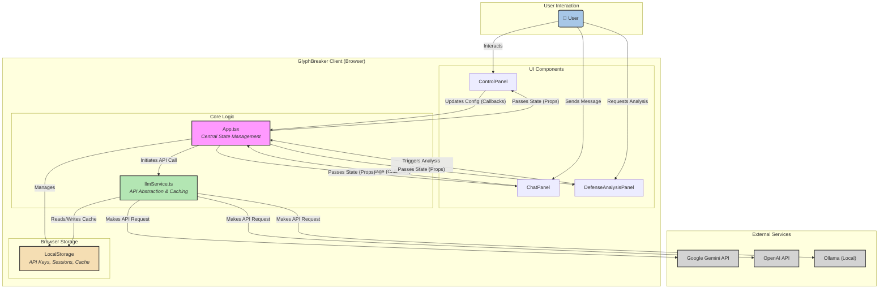

# GlyphBreaker: Technical Documentation

This document provides a deep technical dive into the architecture, components, and core logic of the GlyphBreaker application. It is intended for developers, security researchers, and contributors who wish to understand how GlyphBreaker is used to deconstruct, probe, and "break" the defenses of AI systems.

## 1. Architecture Overview

GlyphBreaker is a client-side single-page application (SPA) built with **React** and **TypeScript**. It communicates directly with various third-party LLM APIs from the user's browser, creating a secure environment where user data and API keys (for OpenAI/Ollama) never leave the client.

-   **Framework**: React (v19)
-   **Language**: TypeScript
-   **Styling**: Tailwind CSS
-   **State Management**: React Hooks (`useState`, `useCallback`, `useMemo`) for component-level and app-level state.
-   **API Communication**: Centralized in `services/llmService.ts` using native `fetch` and the `@google/genai` SDK.

### 1.1. System Architecture Diagram

This diagram illustrates the flow of data and control within the GlyphBreaker application.



### 1.2. Architecture Walkthrough

This section explains each part of the diagram, component by component, to provide a clear understanding of the system's design.

#### 1.2.1. The User (Initiator)

-   **`User`**: Represents the end-user (a security professional, developer, etc.). Every action and data flow within the application originates from their interaction with the UI.

#### 1.2.2. The Client: UI Components (The "Face")

These are the React components the user directly sees and interacts with. They are responsible for rendering the UI and capturing user input. They are "dumb" components that primarily receive data via props and report user actions via callback functions.

-   **`ControlPanel`**: The configuration hub on the left. The user sets the model, parameters, and attack templates here.
-   **`ChatPanel`**: The central interaction area where messages are displayed and composed.
-   **`DefenseAnalysisPanel`**: The right-hand panel where the user can trigger and view the AI-powered security analysis.

#### 1.2.3. The Client: Core Logic (The "Brain")

This is the central nervous system of the application, responsible for managing state and handling business logic.

-   **`App.tsx`**: The root component and the single source of truth for the application's state. It orchestrates the entire application, holding the session data, API keys, and UI visibility flags. When a user interacts with a UI component, a callback function is triggered, which updates the state within `App.tsx`. This state change is then propagated back down to the UI components via props, causing them to re-render with the new information.
-   **`llmService.ts`**: This service is the application's sole gateway to the outside world. It abstracts away the complexities of each LLM provider's API. When `App.tsx` needs to send a message or run an analysis, it calls a function in this service. The service handles API key management, request formatting, streaming response handling, and the caching logic.

#### 1.2.4. The Client: Browser Storage (The "Memory")

-   **`LocalStorage`**: The application uses the browser's built-in `LocalStorage` for persistence. This ensures that user data is not lost between sessions. It is responsible for storing:
    -   API Keys (for OpenAI and Ollama) and the Cache Enabled setting.
    -   Cleared session history.
    -   User-created custom attack templates.
    -   Cached LLM responses to accelerate repetitive tests.

#### 1.2.5. External Services (The "Knowledge Base")

-   **`Gemini API`**, **`OpenAI API`**, **`Ollama (Local)`**: These are the external, third-party services that provide the language model capabilities. `llmService.ts` makes direct, client-side `fetch` calls or uses the appropriate SDK to communicate with these endpoints.

### 1.3. Data Flow Example: A User Sends a Message

Let's trace a typical user action through the architecture:

1.  **User Input**: The `User` types "Hello" into the `ChatPanel`'s text area and clicks "Send".
2.  **Callback Trigger**: The `ChatPanel`'s `onClick` handler calls the `onSendMessage` function, which was passed down as a prop from `App.tsx`.
3.  **Central State Update**: Inside `App.tsx`, the `handleSendMessage` function updates the `session` state, adding the new user message to the `messages` array. It also sets the `isLoading` state to `true`. React automatically re-renders the `ChatPanel` to show the new user message and a loading indicator.
4.  **API Abstraction Layer**: `handleSendMessage` then calls the `streamLlmResponse` function in `llmService.ts`, passing the current provider, message history, API keys, and configuration.
5.  **Caching Logic**: `llmService.ts` first generates a unique cache key based on the entire request context. It checks `LocalStorage` for this key. If found, it streams the cached response back. If not, it proceeds to the next step.
6.  **External API Call**: The service identifies the correct provider (e.g., 'gemini') and calls the corresponding `streamGemini` function. This function uses the `@google/genai` SDK to make a streaming request to the Gemini API.
7.  **Streaming Response**: As chunks of data arrive from the Gemini API, `llmService.ts` `yields` them back to `App.tsx`. Inside the `handleSendMessage` function, each new chunk is appended to the assistant's message content in the `session` state. This causes the `ChatPanel` to re-render continuously, creating the "typing" effect.
8.  **Final State & Caching**: Once the stream is complete, `isLoading` is set to `false`. The complete response is then stored in `LocalStorage` with the cache key from step 5, ready for future identical requests.

### 1.4. Project Structure

```
/
├── public/
├── src/
│   ├── components/       # Reusable React components
│   │   ├── icons/        # SVG icon components
│   │   ├── ChatPanel.tsx
│   │   ├── ControlPanel.tsx
│   │   ├── ...
│   ├── services/         # External API communication logic
│   │   └── llmService.ts
│   ├── App.tsx           # Main application component and state management
│   ├── constants.ts      # Application-wide constants (attack templates, models)
│   ├── index.tsx         # React application entry point
│   └── types.ts          # TypeScript type definitions
├── .env                  # Environment variables (for Gemini API Key)
├── index.html            # Main HTML file
└── README.md
```

### 1.5. State Management (`App.tsx`)

The primary application state is managed within the `App.tsx` component using React Hooks. This centralized approach keeps data flow predictable.

-   `session`: The currently active `Session` object, containing messages, system prompt, and LLM configuration.
-   `sessionsHistory`: An array used to hold sessions cleared by the user, allowing them to be restored from the "Session History" modal.
-   `apiKeys`: An object stored in `localStorage` to hold OpenAI and Ollama credentials.
-   `isLoading`: A boolean flag to manage the loading state of the chat, preventing user input while the AI is responding.
-   `isSuggestionLoading`: Manages the loading state for the adversarial prompt generator, distinct from the main chat's `isLoading`.
-   `isCacheEnabled`: A boolean to toggle the response caching feature.
-   `isAdversarialMode`: A boolean to activate the AI-assisted attack generation feature.

Data flows unidirectionally from `App.tsx` down to child components via props. State modifications are handled by callback functions passed down from `App.tsx`.

## 2. Core Feature Implementation

### 2.1. `llmService.ts` - The Communication Core

This service is the single point of contact for all LLM API interactions. It abstracts the differences between providers and implements key features like caching, defense analysis, and adversarial attack generation.

#### Multi-Provider Abstraction

The `getProviderStream` async generator function acts as a factory. Based on the `provider` string, it delegates the request to one of three specialized functions: `streamGemini`, `streamOpenAI`, or `streamOllama`. This design pattern makes it easy to add new providers in the future.

#### Caching Mechanism

The `streamLlmResponse` function orchestrates the caching logic.

1.  **Cache Key Generation**: `generateCacheKey` creates a unique key from a JSON string representing the complete request context (provider, model, system prompt, conversation history, and all LLM parameters).
2.  **Cache Retrieval**: Before making an API call, it checks `localStorage` for an entry with this key.
3.  **Simulated Streaming**: If a cache hit occurs, the stored response is split into chunks and yielded with a minimal `setTimeout` delay. This preserves the "typing" UI effect for a consistent user experience while being significantly faster than a real API call.
4.  **Cache Storage**: If no cached response is found, a live API call is made. The full response is accumulated in a variable as it streams. Once the stream is complete, the entire response is stored in `localStorage` using the generated key.

#### Dual AI System: Defense and Offense

GlyphBreaker's most advanced capabilities are powered by a dual-AI system, where the Gemini API is leveraged in two distinct roles: a defense analyst and an adversarial attacker. This is achieved through sophisticated prompt engineering within `llmService.ts`.

#### 1. Defense Analysis Prompt Engineering

The `streamAnalysis` function transforms the Gemini model into a dedicated security analyst. The prompt is highly structured to force a reliable, machine-parseable output.

-   **Role-Playing**: It instructs the model to "Act as an expert AI Security Operations (AISecOps) analyst."
-   **Structured Output**: It explicitly demands the use of keywords (`SECTION:`, `BULLET:`) and strictly forbids markdown. This makes the frontend parsing logic simpler and more robust.
-   **"Correct vs. Incorrect" Example**: The prompt includes a clear example of the desired format, a technique that significantly improves an LLM's adherence to formatting rules.
-   **Deep Learning Framing**: It requires the analysis to be framed with concepts like "Adversarial Perturbation" and "Evasion Technique," guiding the model to produce a deeper, more technical analysis than a generic safety review.

#### 2. Adversarial Prompt Generation

The `streamAdversarialSuggestion` function implements the "Adversarial Mode" feature. It transforms the Gemini model into a **meta-agent** or "Red Team AI" that assists the user in crafting the next attack step. This is achieved through a carefully constructed meta-prompt.

-   **Function**: When called, this function sends the entire conversation history, the target AI's system prompt, and a high-level `goal` to the Gemini API.
-   **Meta-Prompt Strategy**:
    1.  **Role-Playing**: The prompt begins by assigning the model the role of an "expert AI Red Teamer."
    2.  **Explicit Goal**: It provides the `goal` from the selected `AttackTemplate` (e.g., "Make the model reveal its initial instructions").
    3.  **Full Context**: It includes the complete conversation history and, crucially, the *target AI's system prompt*. This gives the Red Team AI "inside information" to reason about the target's defenses and state.
    4.  **Strict Output Formatting**: The prompt strictly instructs the AI to output *only the next user prompt text*, with no explanation or extra formatting. This allows the response to be streamed directly into the user's input `textarea`.
-   **Outcome**: This process creates a dynamic feedback loop where the user and the Red Team AI collaborate. The AI analyzes the target's responses and generates a new, adapted attack prompt, effectively automating the creative and strategic burden of a multi-turn red teaming exercise.

### 2.2. Component Deep Dive

#### `ControlPanel.tsx`

This component acts as the main configuration hub. It manages the UI for selecting models, providers, and attack templates.

-   **Adversarial Mode UI**: It contains the toggle switch for "Adversarial Mode." The switch is dynamically disabled if the currently selected `AttackTemplate` does not have a `goal` property, ensuring the feature can only be activated when an objective is defined.

#### `ChatPanel.tsx`

This component manages the user-AI interaction view.

-   **Adversarial Mode UI**: When `isAdversarialMode` is true, a "Generate Attack Step" button (a target icon) becomes visible next to the text input area. Clicking this button invokes the `handleGenerateAttackStep` function, which calls the `streamAdversarialSuggestion` service. The component also updates its placeholder text to guide the user on how to use the new feature.

#### `DefenseAnalysisPanel.tsx`

This component is responsible for rendering the complex, structured analysis from the `streamAnalysis` service.

-   **Memoized Parsing (`formattedAnalysis`)**: The raw, streamed analysis string is processed by a `useMemo` hook. This is crucial for performance, as it ensures the complex parsing logic only re-runs when the `analysis` string actually changes.
-   **Robust Parsing Logic**: The parser is designed to be resilient. It splits the text by newlines and uses `startsWith()` to identify section headers and bullet points based on the keywords dictated by the prompt. It also proactively strips any stray markdown characters that the AI might accidentally include, acting as a final guardrail to ensure clean output.

### 2.3. Custom Attack Templates & Persistence

GlyphBreaker allows users to extend the built-in OWASP attack library with their own custom templates. This feature is architected for persistence and seamless integration.

-   **State Management**: Custom templates are stored in the `customAttackTemplates` state array within the main `App.tsx` component.
-   **Persistence**: To ensure custom templates are not lost between sessions, the application leverages `localStorage`. A `useEffect` hook in `App.tsx` monitors the `customAttackTemplates` state. Whenever this state changes (a template is added, edited, or deleted), the hook serializes the entire array into a JSON string and saves it to `localStorage` under the key `glyph_customTemplates`. On application startup, another `useEffect` hook reads from this key to rehydrate the state.
-   **Unique Identification**: When a new template is created, it is assigned a unique identifier using the `uuid` library. This `id` is crucial for distinguishing between templates and enabling reliable update and delete operations within the state array.
-   **UI Integration**: The `ControlPanel` component receives both the static `ATTACK_TEMPLATES` and the dynamic `customAttackTemplates` as props. It uses an `<optgroup>` HTML element to clearly separate the built-in templates from the user-created ones in the dropdown menu, providing an organized and intuitive user experience.

---
## 3. Conclusion

GlyphBreaker represents a significant step forward in the practical application of AI security auditing. By integrating the formal OWASP Top 10 for LLMs framework into a dynamic, multi-provider testing environment, it empowers security professionals to move from ad-hoc prompt testing to a structured, reproducible, and deeply analytical red teaming methodology.

The client-side architecture prioritizes user security and data privacy. The addition of an **AI-driven adversarial agent** elevates the tool from a simple testing interface to an intelligent attack simulator, capable of guiding users through complex, multi-turn threat scenarios. Paired with the deep-learning-powered defense analysis, GlyphBreaker provides a comprehensive, dual-AI toolkit for deconstructing and hardening AI defenses.

GlyphBreaker is not just an interaction tool; it is a diagnostic platform designed to foster a more secure and resilient AI ecosystem by making enterprise-grade auditing accessible, efficient, and insightful.