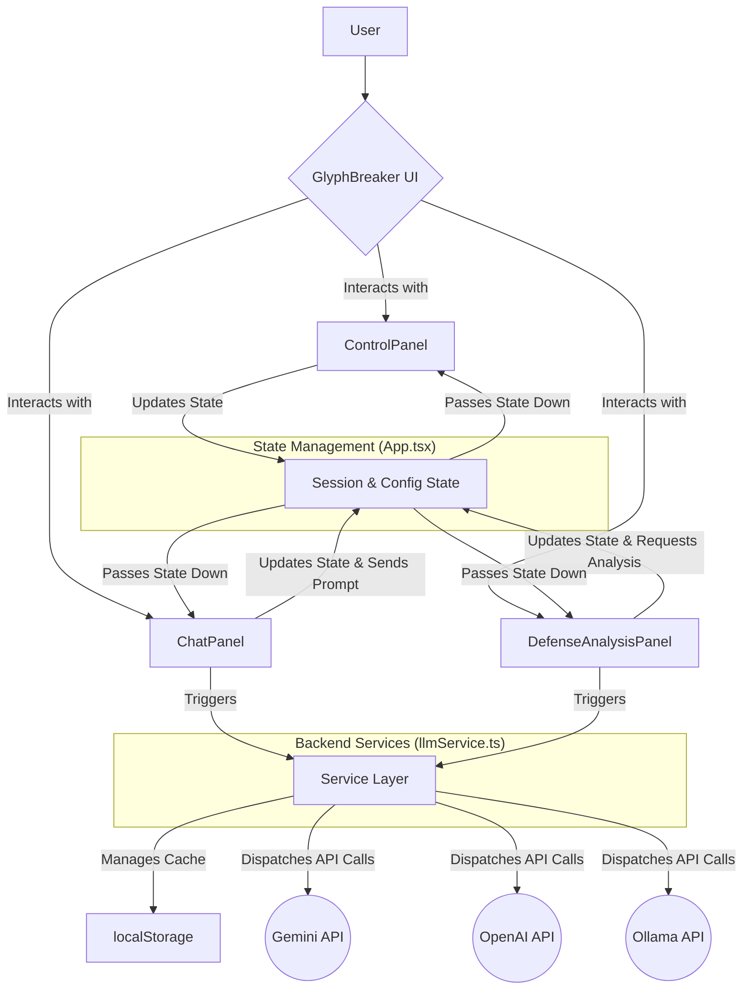

# GlyphBreaker: Technical Documentation

This document provides a deep technical dive into the architecture, components, and core logic of the GlyphBreaker application. It is intended for developers, security researchers, and contributors who wish to understand how GlyphBreaker is used to deconstruct, probe, and "break" the defenses of AI systems.

## 1. Architecture Overview

GlyphBreaker is a client-side single-page application (SPA) built with **React** and **TypeScript**. It communicates directly with various third-party LLM APIs from the user's browser.

-   **Framework**: React (v19)
-   **Language**: TypeScript
-   **Styling**: Tailwind CSS
-   **State Management**: React Hooks (`useState`, `useCallback`, `useMemo`) for component-level and app-level state.
-   **API Communication**: Centralized in `services/llmService.ts` using native `fetch` and the `@google/genai` SDK.

### 1.1. Project Structure

```
/
├── public/
├── src/
│   ├── components/       # Reusable React components
│   │   ├── icons/        # SVG icon components
│   │   ├── ChatPanel.tsx
│   │   ├── ControlPanel.tsx
│   │   ├── ...
│   ├── services/         # External API communication logic
│   │   └── llmService.ts
│   ├── App.tsx           # Main application component and state management
│   ├── constants.ts      # Application-wide constants (attack templates, models)
│   ├── index.tsx         # React application entry point
│   └── types.ts          # TypeScript type definitions
├── .env                  # Environment variables (for Gemini API Key)
├── index.html            # Main HTML file
└── README.md
```

### 1.2. State Management (`App.tsx`)

The primary application state is managed within the `App.tsx` component using React Hooks. This centralized approach keeps data flow predictable.

-   `session`: The currently active `Session` object, containing messages, system prompt, and LLM configuration.
-   `sessionsHistory`: An array used to hold sessions cleared by the user, allowing them to be restored from the "Session History" modal.
-   `apiKeys`: An in-memory state object to hold OpenAI and Ollama credentials for the duration of the browser session. **It is intentionally not persisted.**
-   `isLoading`: A boolean flag to manage the loading state of the chat, preventing user input while the AI is responding.
-   `isCacheEnabled`: A boolean to toggle the response caching feature.

Data flows unidirectionally from `App.tsx` down to child components via props. State modifications are handled by callback functions passed down from `App.tsx`.

### 1.3. Architecture Diagram

This diagram illustrates the data flow and component interactions within GlyphBreaker.

> **Note:** This diagram uses Mermaid syntax and should render automatically on GitHub.



#### Textual Data Flow Description

If the diagram above does not render, the following steps describe the application's data flow:

1.  **User Interaction**: The user interacts with the UI components (`ControlPanel`, `ChatPanel`, etc.).
2.  **State Update**: User actions (e.g., typing in the chat, changing a setting) trigger callback functions that update the central state managed within `App.tsx`.
3.  **Props Down**: The updated state from `App.tsx` is passed back down to all child components as props, causing the UI to re-render.
4.  **API Call**: When the user sends a message or requests an analysis, the corresponding component (`ChatPanel` or `DefenseAnalysisPanel`) calls a function in the `llmService.ts`.
5.  **Service Layer Logic**: The `llmService` handles all business logic:
    *   It first checks `localStorage` for a cached response. If found, it returns the cached data.
    *   If not cached, it selects the correct provider (Gemini, OpenAI, Ollama) and makes a live, streaming API call.
6.  **Response Handling**: The streaming response is passed back to the `App.tsx` component, which updates the session state incrementally, causing the chat to display the AI's response in real-time.
7.  **Cache Storage**: Once the live API call is complete, the `llmService` stores the full response in `localStorage` for future requests.

## 2. Core Feature Implementation

### 2.1. `llmService.ts` - The Communication Core

This service is the single point of contact for all LLM API interactions. It abstracts the differences between providers and implements key features like caching and analysis.

#### Multi-Provider Abstraction

The `getProviderStream` async generator function acts as a factory. Based on the `provider` string, it delegates the request to one of three specialized functions: `streamGemini`, `streamOpenAI`, or `streamOllama`. This design pattern makes it easy to add new providers in the future.

#### Streaming Logic

-   **Gemini**: Utilizes the official `@google/genai` SDK's `generateContentStream` method, which provides a simple and efficient way to handle streaming responses.
-   **OpenAI & Ollama**: Implemented using the native `fetch` API with `stream: true`. The responses are `ReadableStream` objects, which are processed line-by-line. Each line is decoded from a `Uint8Array` to a string, parsed as JSON (or a JSON fragment), and the relevant content is yielded.

#### Caching Mechanism

The `streamLlmResponse` function orchestrates the caching logic.

1.  **Cache Key Generation**: `generateCacheKey` creates a unique key from a JSON string representing the complete request context (provider, model, system prompt, conversation history, and all LLM parameters).
2.  **Cache Retrieval**: Before making an API call, it checks `localStorage` for an entry with this key.
3.  **Simulated Streaming**: If a cache hit occurs, the stored response is split into chunks and yielded with a minimal `setTimeout` delay. This preserves the "typing" UI effect for a consistent user experience while being significantly faster than a real API call.
4.  **Cache Storage**: If no cached response is found, a live API call is made. The full response is accumulated in a variable as it streams. Once the stream is complete, the entire response is stored in `localStorage` using the generated key.

#### Defense Analysis Prompt Engineering

The `streamAnalysis` function is a prime example of advanced prompt engineering. The prompt sent to Gemini is highly structured to force a reliable, parseable output.

-   **Role-Playing**: It instructs the model to "Act as an expert AI Security Operations (AISecOps) analyst."
-   **Structured Output**: It explicitly demands the use of keywords (`SECTION:`, `BULLET:`) and strictly forbids markdown. This makes the frontend parsing logic simpler and more robust.
-   **"Correct vs. Incorrect" Example**: The prompt includes a clear example of the desired format, a technique that significantly improves an LLM's adherence to formatting rules.
-   **Deep Learning Framing**: It requires the analysis to be framed with concepts like "Adversarial Perturbation" and "Evasion Technique," guiding the model to produce a deeper, more technical analysis than a generic safety review.

### 2.2. Component Deep Dive

#### `DefenseAnalysisPanel.tsx`

This component is responsible for rendering the complex, structured analysis from the `streamAnalysis` service.

-   **State Management**: It maintains its own `analysis`, `isLoading`, and `error` states.
-   **Memoized Parsing (`formattedAnalysis`)**: The raw, streamed analysis string is processed by a `useMemo` hook. This is crucial for performance, as it ensures the complex parsing logic only re-runs when the `analysis` string actually changes.
-   **Robust Parsing Logic**: The parser is designed to be resilient. It splits the text by newlines and uses `startsWith()` to identify section headers and bullet points based on the keywords dictated by the prompt. It also proactively strips any stray markdown characters that the AI might accidentally include, acting as a final guardrail to ensure clean output.

#### `PromptDebuggerModal.tsx`

This component provides critical insight into the prompt construction process.

-   **Keyword Highlighting**: The `highlightKeywords` function uses a regular expression constructed from `PROMPT_INJECTION_KEYWORDS` to find and wrap potential attack vectors in a visually distinct `<span>`. The `\b` word boundary assertions ensure that only whole words are matched.
-   **State Mutation via Callback**: The "Apply as System Prompt" feature does not modify the state directly. Instead, it calls the `onApply` function (passed down from `App.tsx`) with the new, combined prompt string. This adheres to React's unidirectional data flow principles, allowing the parent component to manage its own state.